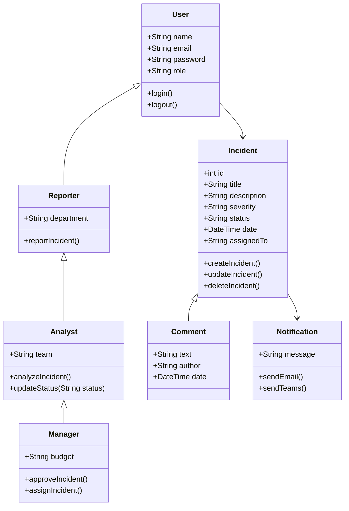

<!--
Sortie de référence — à remplacer par la sortie réelle capturée lors de la préparation (date, outil, modèle).
Prompt utilisé : « Fais-moi le diagramme de classes UML d'IncidentHub, une plateforme de signalement d'incidents cyber. »
-->

# Modèle IncidentHub généré par une IA (prompt naïf)

## À observer en classe

- Chaîne d'héritage : un `Manager` est-il vraiment une sorte d'`Analyst`, lui-même une sorte de `Reporter` ?
- `Comment` hérite d'`Incident` : un commentaire *est-il* un incident, ou *appartient-il* à un incident ?
- Tout est public (`+`) : où est l'encapsulation vue en séance 1 ?
- Aucune multiplicité : combien de commentaires par incident ? Combien d'analystes ?
- `status` et `severity` en `String` : on a perdu les `enum`.
- `role` en texte dans `User` alors que les classes dérivées existent déjà.
- `password` en clair dans le modèle, `Notification` qui mélange tous les canaux.

Comparer avec le code de `main` (tag `s02-etape4-polymorphisme-composition`).
